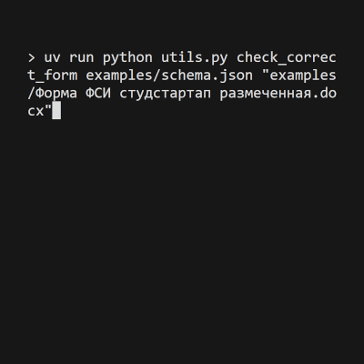
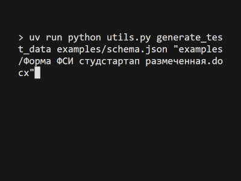

# ИИ заполнение Word форм

[Хабр статья](https://habr.com/ru/sandbox/244650/)

## Установка зависимостей
Требуется пакетный менеджер uv:
```shell
uv sync --frozen --no-dev
```

## Шаг 1. ИИ Анализ формы
```shell
uv run python word_parser.py "examples/Форма ФСИ студстартап.docx" -o examples/schema.json
```

## Шаг 2. Разметка формы
Получаем список id полей с помощью утилиты
```shell
uv run python utils.py jinja_fields examples/schema.json
```


Размечаем шаблон используя [Jinja2 синтаксис](https://docxtpl.readthedocs.io/en/latest/#jinja2-like-syntax)


Проверяем корректность заполнения
```shell
uv run python utils.py check_correct_form examples/schema.json "examples/Форма ФСИ студстартап размеченная.docx"
```



Исправляем неправильные теги. Проверяем еще раз


Заполняем тестовыми данными
```shell
uv run python utils.py generate_test_data examples/schema.json "examples/Форма ФСИ студстартап размеченная.docx"
```



## Шаг 3. Заполнение ИИ
```shell
uv run python word_fill.py examples/schema.json "examples/Форма ФСИ студстартап размеченная.docx" examples/документ1.docx
```


